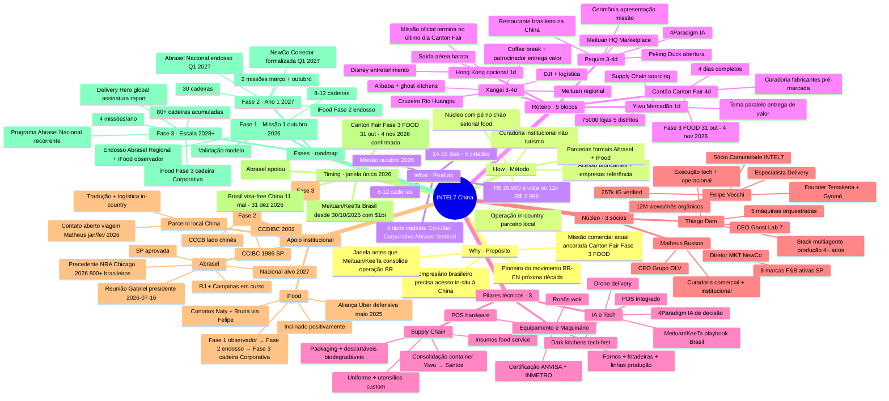
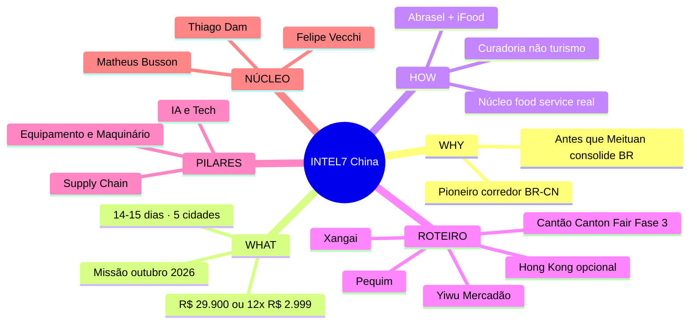
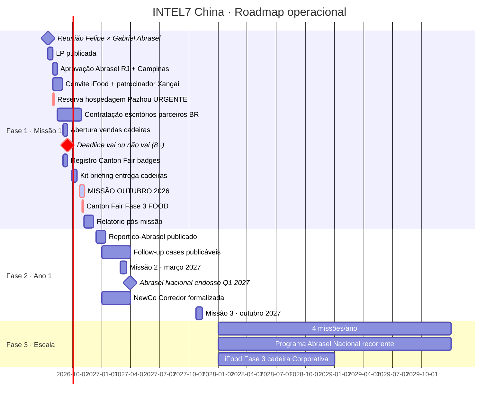

# Mindmap · estrutura visual do projeto INTEL7 China

**Framework Tony Buzan (1974).** Visualização hierárquica-associativa do projeto INTEL7 China. Documento canônico para orientação executiva rápida (30 segundos de leitura → entendimento macro).

Usado em: apresentação Abrasel · onboarding cadeiras · comunicação institucional · site LP.

## Mindmap canônico (formato Mermaid)

## Mindmap simplificado (para hero da LP)

## Visualização de dependências críticas (grafo)

```mermaid
graph TB
    A[Missão outubro 2026] --> B{Canton Fair Fase 3<br/>FOOD confirmada}
    A --> C{Endosso Abrasel<br/>Regional + Nacional}
    A --> D{iFood inclinado<br/>positivamente}
    A --> E{Visa-free BR-CN<br/>ativo até 31 dez 2026}
    A --> F{Parceiro local<br/>China contratado}

    B --> B1[Registro Canton Fair<br/>badge por cadeira]
    B --> B2[Hospedagem Pazhou<br/>URGENTE reservar]

    C --> C1[Reunião Gabriel<br/>2026-07-16]
    C --> C2[Aprovação RJ + Campinas<br/>até 2026-08-15]
    C --> C3[Head Missões<br/>Internacionais Abrasel]

    D --> D1[Convite iFood<br/>Naty/Bruna via Felipe]
    D --> D2[Cadeira Corporativa<br/>executivo iFood]

    F --> F1[Backup parceiro<br/>in-country stand-by]

    A --> G[Vendas cadeiras<br/>abertura setembro 2026]
    G --> G1[8-12 cadeiras<br/>deadline 15/set/2026]
    G --> G2[LP + pitch cinematográfico<br/>upload julho 2026]

    A --> H[Escritórios parceiros BR]
    H --> H1[ANVISA + INMETRO<br/>até 2026-09-30]
    H --> H2[Despachante Santos<br/>até 2026-10-30]
    H --> H3[Consultor tributário<br/>até 2026-10-30]
    H --> H4[Auditor QC in-country<br/>até 2026-09-15]

    classDef critical fill:#b91c1c,stroke:#7f1d1d,color:#fff
    classDef important fill:#c9a961,stroke:#8f6f2f,color:#000
    classDef standard fill:#0a0d0a,stroke:#00a352,color:#fff

    class B,C,D,E,F critical
    class B1,B2,C1,C2,D1,H1 important
```

## Visualização temporal (Gantt)

## Como usar este mindmap

**Para reunião Abrasel (Felipe × Gabriel 2026-07-16):**
- Abrir mindmap simplificado (hero da LP) · projetar no iPad em fullscreen
- Explicar cada ramo em 30 segundos
- Retornar ao root após cada ramo (mantém foco no root INTEL7 China)

**Para onboarding cadeira:**
- Dia 2 da missão (cerimônia de abertura) · projetar mindmap canônico no telão hotel Pequim
- Mostrar como cada elemento se conecta a próxima cadeira
- Rotate por ramos conforme cadeira pede detalhes

**Para comunicação institucional:**
- Mindmap simplificado no rodapé do relatório co-Abrasel
- Mindmap canônico em anexo técnico
- Cada versão em PT + inglês (Fase 2)

**Para site LP:**
- Mindmap canônico como seção interativa (Mermaid.js live rendering)
- Cadeira clica no ramo · expande sub-nós
- Efeito wow: cadeira "descobre" a densidade do projeto sozinha

## Como manter atualizado

- **Trimestral** · atualizar mindmap canônico com progresso Fase 1 → Fase 2 → Fase 3
- **Post-missão** · adicionar cadeiras alumni como ramo separado (rede)
- **Post-endosso Abrasel Nacional** · elevar ramo Abrasel para nível root (sub-hub)
- **Post-NewCo Corredor** · elevar ramo Ecosistema para nível root (sub-hub)

## Related

- `docs/estrategia/why.md` · Golden Circle (alimenta root/Why)
- `docs/estrategia/business-model-canvas.md` · BMC (detalha What/Como/Recursos)
- `docs/estrategia/swot.md` · SWOT (alimenta Timing + Ameaças)
- `docs/estrategia/pestle.md` · PESTLE (alimenta Timing + Fatores macro)
- `docs/estrategia/flywheel.md` · Flywheel (alimenta Fases roadmap)
- `docs/estrategia/concorrentes.md` · concorrentes (contexto competitivo)

## Changelog

**v1.0 · 2026-07-15** · Mindmap canônico Mermaid + versão simplificada hero + grafo dependências críticas + Gantt temporal 2026-2028 · 4 formatos de visualização para uso em contextos diferentes (reunião · onboarding · comunicação · site).
